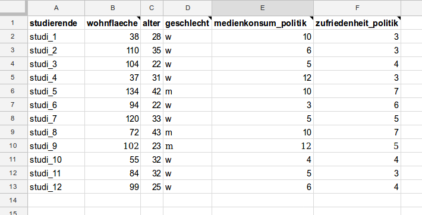

Big Data Lehrveranstaltung @ FH Joanneum
==============================

Dieses Repository enthält alle Informationen und Materialen zur Lehrveranstaltung "Big Data" an der FH Joanneum Graz. Dies dient als Grundlage für die Vorbereitung der LV sowie als Dokumentation vor Ort und nach der LV.

- Datum: 11. März 2017, 9-18 Uhr
- Ort: FH Joanneum, Alte Poststraße 152, Graz
- Lehrende: 
    - [Stefan Kasberger](http://stefankasberger.at/) ([@stefankasberger](https://twitter.com/stefankasberger))
	- [Peter Grassberger](http://petergrassberger.at/) ([@PeterTheOne](https://twitter.com/PeterTheOne))

Der Inhalt hier steht, soweit nicht explizit anders erwähnt, unter der [Creative Commons Namensnennung 4.0 Lizenz](https://creativecommons.org/licenses/by/4.0/).

## VORBEREITUNG

Zur Vorbereitung soll der Artikel "**[Ich habe nur gezeigt, dass es die Bombe gibt](https://www.dasmagazin.ch/2016/12/03/ich-habe-nur-gezeigt-dass-es-die-bombe-gibt/)**". Der Artikel gibt einen Einblick in verschiedene Aspekte, die uns in der Lehrveranstaltung begleiten und welche wir gemeinsam vor Ort diskutieren werden.

## LV ABLAUF

| Timetable     | Agenda       |
|---------------|--------------|
| 9:00 - 9:15 | Einleitung |
| 9:15 - 10:45 | Big Data Einführung |
| 10:45 - 11:05 | Diskussion Cambridge Analytica |
| 11:05 - 11:20 | Pause |
| 11:20 - 12:00 | Open Data |
| 12:00 - 12:30 | Setup Coding |
| 12:30 - 13:30 | Mittag |
| 13:30 - 15:15 | Coden 1 |
| 15:15 - 15:30 | Pause |
| 15:30 - 16:50 | Coden 2 |
| 16:50 - 17:00 | Verabschiedung |

### 1. Willkommen
[Stefan Kasberger](http://stefankasberger.at/) studiert Umweltsystemwissenschaften Geographie an der Karl Franzens Universtität Graz und forscht im Bereich Computational Social Science. Nebenbei ist er selbstständig als Training Manager bei [ContentMine](http://contentmine.org/) tätig, einem Projekt aus Cambridge UK, das sich mit Text und Data Mining beschäftigt. Weiters ist er auch Obmann von [Open Knowledge Österreich](http://okfn.at/), einem Verein, der sich für offenes und freies Wissen einsetzt.

[Peter Grassberger](http://petergrassberger.at/) studierte dann Medientechnik und -design im Bachelor an der FH Hagenberg. Aktuell ist er Selbstständig als Web- und Softwareentwickler in Graz, studiert Softwareentwicklung-Wirtschaft im Master an der TU Graz und ist (Netz)politisch aktiv.

### 2. Big Data

**Big Data ist in aller Munde, doch was ist damit gemeint?**

Bei der Einführung in den Begriff Big Data werden Schritt für Schritt die relevanten Aspekte erörtert und gemeinsam in interaktiven Formaten direkt erfasst. 

Bei der theoretischen Einführung wird erklärt, was ein Algorithmus ist, wie ein Algorithmus lernt, welche Rolle Daten dabei spielen und welche Grenzen und Probleme es dabei gibt. 

Mittels einem interaktiven Format erleben die Studierenden dann direkt wie ein Algorithmus Entscheidungen trifft und welche Auswirkungen dies auf sie selber und die Gesellschaft haben kann. Dazu werden von Studierenden Daten zu wie Alter, Wohnfläche, Geschlecht, Medienkonsum pro Woche und Zufriedenheit mit Politik gesammelt. Die Daten werden dann auf drei Algorithmen (2 fix vorgegebene und ein lernender) angewendet und die Unterschiede diskutiert.

Mit dem dadurch erlangten Verständnis werden noch einige bekannte und relevante Anwendungsfälle von lernenden Algorithmen gezeigt und diskutiert (z. B. Facebook Gesichter-Erkennung, Amazon Empfehlungen, Autonome Autos, etc.). Der Theorie-Teil wird dann mit einen Blick auf das Wechselspiel von Technologie und Mensch abgerundet.

Zum Schluss wird das erlernte Wissen im Zuge einer Diskussion zu dem Artikel "[Ich habe nur gezeigt, dass es die Bombe gibt](https://www.dasmagazin.ch/2016/12/03/ich-habe-nur-gezeigt-dass-es-die-bombe-gibt/)" über Cambridge Analytica und dem Einfluss auf die Wahl von Donald Trump angewendet und kritisch hinterfragt.

**-> [Folien Big Data](https://www.slideshare.net/cheeseman1983/einfhrung-big-data)**

**Quellen**
- [Big Data](https://de.wikipedia.org/wiki/Big_Data)
- [Algorithmus](https://de.wikipedia.org/wiki/Algorithmus)
- [Künstliche Intelligenz](https://de.wikipedia.org/wiki/K%C3%BCnstliche_Intelligenz)
- [Maschinelles Lernen](https://de.wikipedia.org/wiki/Maschinelles_Lernen)
- [Recomender Systeme](https://de.wikipedia.org/wiki/Empfehlungsdienst)
- [Selbstfahrendes Kraftfahrzeug](https://de.wikipedia.org/wiki/Selbstfahrendes_Kraftfahrzeug)
- [IBM Watson](https://de.wikipedia.org/wiki/Watson_(K%C3%BCnstliche_Intelligenz))
- [Google DeepMind](https://de.wikipedia.org/wiki/Google_DeepMind)
- [Machine Bias: There’s Software Used Across the Country to Predict Future Criminals. And it’s Biased Against Blacks.](https://www.propublica.org/article/machine-bias-risk-assessments-in-criminal-sentencing)
- [Private traits and attributes are predictable from digital records of human behavior](http://www.pnas.org/content/110/15/5802.abstract)
- [Discrimination in Online Ad Delivery](http://queue.acm.org/detail.cfm?id=2460278)
- [Measuring Price Discrimination and Steering on E-commerce Web Sites](http://dl.acm.org/citation.cfm?id=2663744)
- [Ich habe nur gezeigt, dass es die Bombe gibt](https://www.dasmagazin.ch/2016/12/03/ich-habe-nur-gezeigt-dass-es-die-bombe-gibt/)
- [Cambridge Analytica und die schmutzige Bombe](http://de-bug.de/blog/medien/cambridge-analytica-und-die-schmutzige-bombe)
- [Mit Big Data Wähler manipulieren: "So einfach ist das nicht"](https://futurezone.at/netzpolitik/mit-big-data-waehler-manipulieren-so-einfach-ist-das-nicht/234.371.739)
- [Vortrag Wolfie Christl zu Big-Data-Business, Profiling & Privacy @ 14. #netzpat](https://www.youtube.com/watch?v=33WIDqehSjY)

### 3. Open Data

**Daten als Gemeingut.**

Open Data befreit Daten und ermöglicht allen das Verwenden dieser. Bei der Einführung werden die Vorteile und Probleme die dabei auftreten erörtert. 

Dann wird anhand des Projektes [Offene Wahlen Österreich](http://offenewahlen.at/) auf praktischer Ebene die Stärke und Relevanz von Open Data erklärt und ein Einblick in die Arbeit mit offenen Daten gegeben.

**-> [Folien Open Data](slides_open-data.pdf)**

**Quellen**
- [Open Data](https://de.wikipedia.org/wiki/Open_Data)
- [Offene Wahlen Österreich](http://offenewahlen.at/)
- [Open Definition](http://opendefinition.org/)
- [Creative Commons](http://creativecommons.org/)
- [Open Government Data Portal Österreich](http://data.gv.at/)
- [OpenDataPortal Österreich](https://www.opendataportal.at/)
- [OpenStreetMap](http://openstreetmap.org/)
- [Informationsfreiheitsgesetz](https://www.informationsfreiheit.at/)

### 4. Coden

Mittels JavaScript werden gemeinsam die ersten Schritte im Programmieren erlernt. Anhand dem erstellen eines Balkendiagrammes mit dem das Ergebnis einer Wahl visuell dargestellt wird, werden die Grundlagen im programmatischen Denken vermittelt, und so die Anwendung von Algorithmen und Daten von eigener Hand erlebt.

**Ressourcen**
- [Sublime Text](https://www.sublimetext.com/)
- [Tutorial: Balkendiagramm](http://offenewahlen.at/tutorials/balkendiagramm/)
- [Tutorial: Wahl-Karte](http://offenewahlen.at/tutorials/karte/)
- [Videos von GangMan2006 @ Youtube](https://www.youtube.com/user/GangMan2006)
- [Nachschlagewerk: developer.mozilla.org](https://developer.mozilla.org)
- [Fragen stellen: Stackoverflow](https://stackoverflow.com)
- [Interaktiv Lernen: CodeAcademy](https://www.codecademy.com)
- [Interaktiv Lernen: Code School](https://www.codeschool.com/)
- [Interaktiv Lernen: Khan Academy](https://www.khanacademy.org/computing/computer-programming/programming)
- [Udacity Course: JavaScript Basics for Beginners](https://www.udacity.com/course/javascript-basics--ud804)
- [Intro to jQuery](https://www.udacity.com/course/intro-to-jquery--ud245)
- [Data Visualization and D3.js](https://www.udacity.com/course/data-visualization-and-d3js--ud507)

## RESSOURCEN 

- [Folien Big Data](https://www.slideshare.net/cheeseman1983/einfhrung-big-data)
- [Folien Open Data](slides_open-data.pdf)

